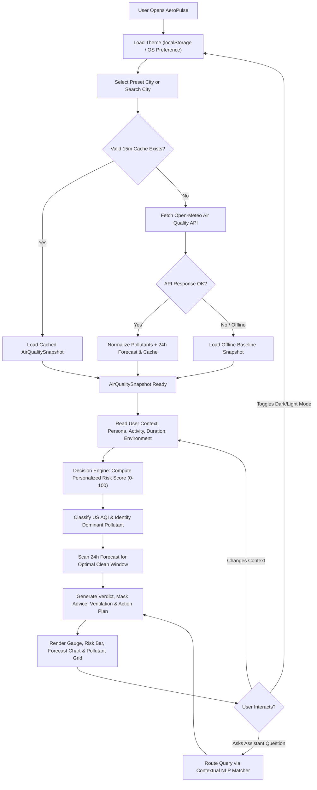
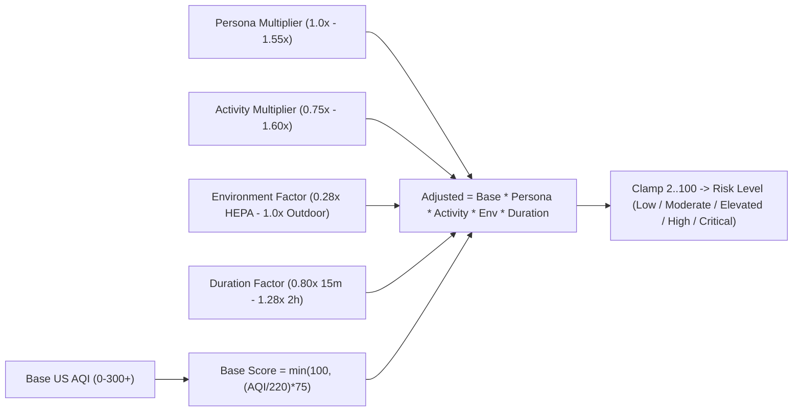

# System Architecture & Decision Flowchart

## 1. End-to-End User & Data Flow

```mermaid
flowchart TD
    A["User Opens AeroPulse"] --> B["Load Theme (localStorage / OS Preference)"]
    B --> C["Select Preset City or Search City"]
    C --> D{"Valid 15m Cache Exists?"}
    D -- Yes --> E["Load Cached AirQualitySnapshot"]
    D -- No --> F["Fetch Open-Meteo Air Quality API"]
    F --> G{"API Response OK?"}
    G -- Yes --> H["Normalize Pollutants + 24h Forecast & Cache"]
    G -- No / Offline --> I["Load Offline Baseline Snapshot"]
    E --> J["AirQualitySnapshot Ready"]
    H --> J
    I --> J

    J --> K["Read User Context: Persona, Activity, Duration, Environment"]
    K --> L["Decision Engine: Compute Personalized Risk Score (0-100)"]
    L --> M["Classify US AQI & Identify Dominant Pollutant"]
    M --> N["Scan 24h Forecast for Optimal Clean Window"]
    N --> O["Generate Verdict, Mask Advice, Ventilation & Action Plan"]
    O --> P["Render Gauge, Risk Bar, Forecast Chart & Pollutant Grid"]

    P --> Q{"User Interacts?"}
    Q -- Changes Context --> K
    Q -- Asks Assistant Question --> R["Route Query via Contextual NLP Matcher"]
    R --> O
    Q -- Toggles Dark/Light Mode --> B
```

## 2. Personalized Risk Scoring Logic

```mermaid
flowchart LR
    AQI["Base US AQI (0-300+)"] --> Base["Base Score = min(100, (AQI/220)*75)"]
    Persona["Persona Multiplier (1.0x - 1.55x)"] --> Calc["Adjusted = Base * Persona * Activity * Env * Duration"]
    Activity["Activity Multiplier (0.75x - 1.60x)"] --> Calc
    Env["Environment Factor (0.28x HEPA - 1.0x Outdoor)"] --> Calc
    Dur["Duration Factor (0.80x 15m - 1.28x 2h)"] --> Calc
    Base --> Calc
    Calc --> Clamp["Clamp 2..100 -> Risk Level (Low / Moderate / Elevated / High / Critical)"]
```
